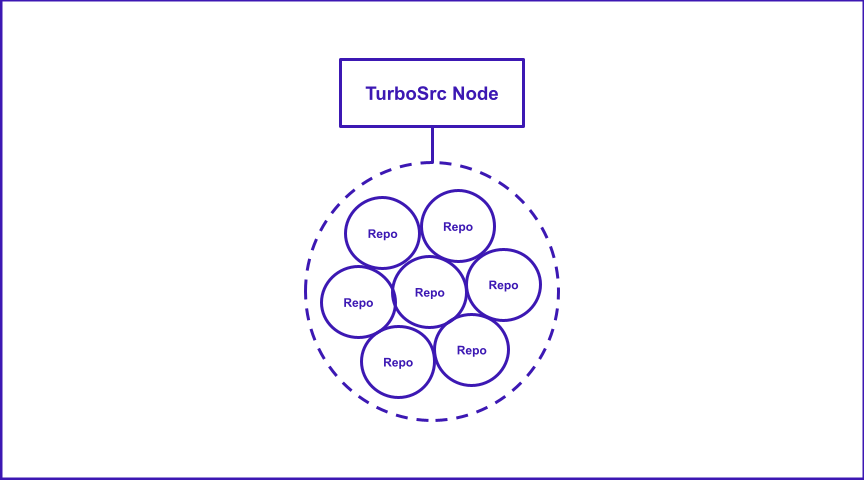
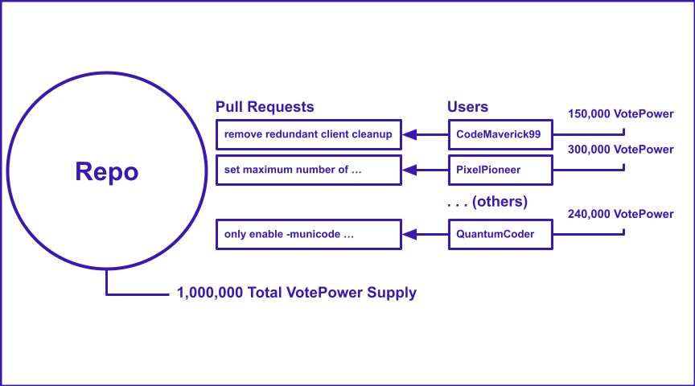
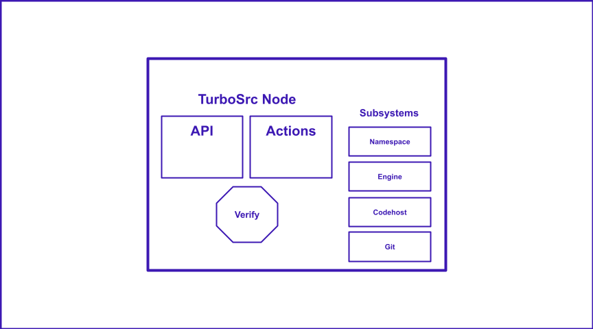
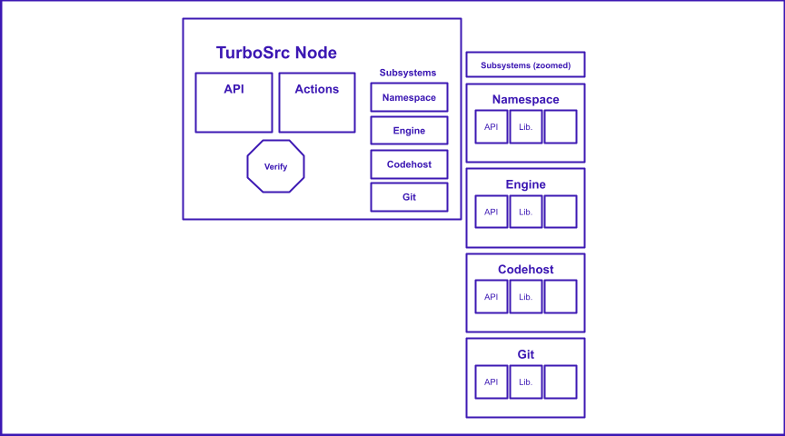
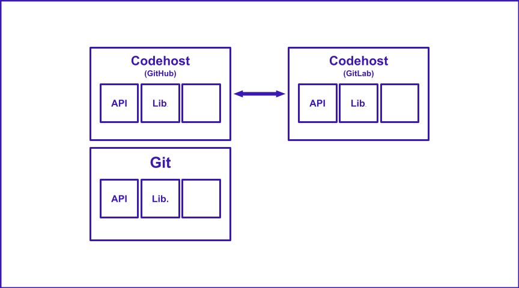
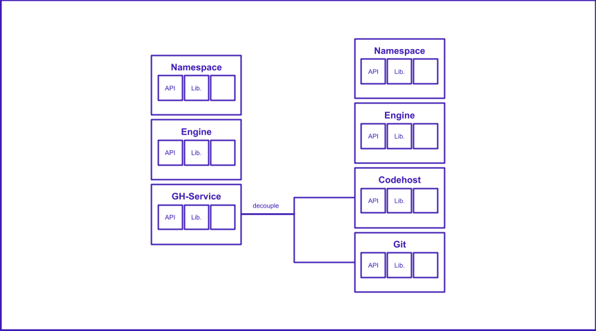
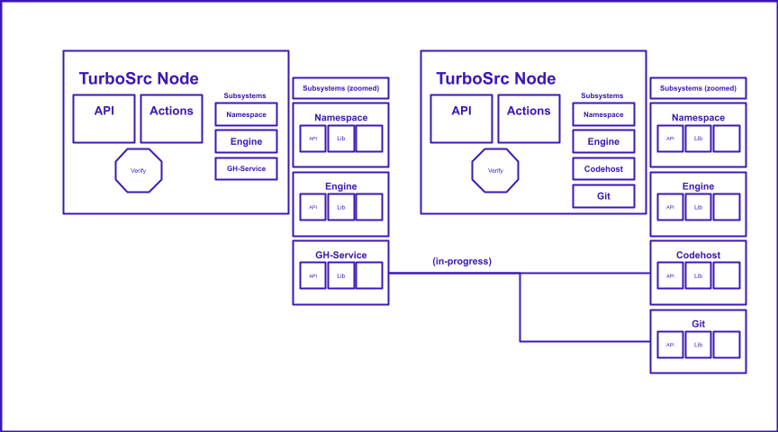
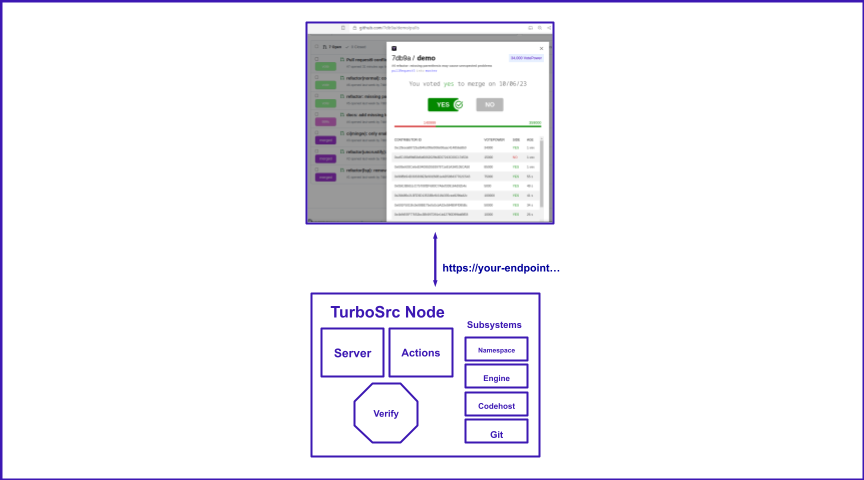
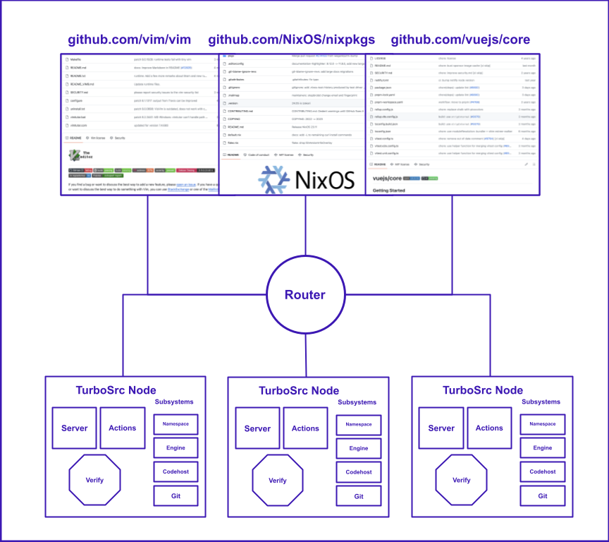

<p align="left">
  <a href="https://turbosrc.org#gh-light-mode-only">
    
  </a>
  <a href="https://turbosrc.org#gh-dark-mode-only">
    
  </a>
</p>
<p align="left">
  <em><strong>Empowering open source communities</em></strong>
</p>

<br>

TurboSrc is a unique platform designed to promote transparency and boost community participation in your open-source projects. Our innovative voting system for pull requests not only empowers contributors but also enriches the overall development experience.

It currently works as a Chrome web extension for Github, but the plan is to develop it across multiple code hosts if necessary. The Turbosrc instance has a full api and its own internal representation of code bases and their pull requests.

While we're currently in active development and the pre-alpha phase, your support and patience are much appreciated. Our goal is to develop TurboSrc into a valuable tool for all open-source projects.

For your convenience, we make it super easy to experiment with TurboSrc in the meantime. Setup a local instance and safely play around as much as you like: skip to [Setting up a local TurboSrc instance](#setting-up-a-local-turbosrc-instance).

## Highlights
* **Launch Your Own TurboSrc Instance:** Enhance your project's community involvement by setting up your unique TurboSrc instance.
* **Harness VotePower:** Empower your TurboSrc instance users with the ability to vote on pull requests using VotePower.
* **Effortless VotePower Distribution:** Distribute VotePower to your project's community members directly through your Github page integrated with TurboSrc.

Let's get you started!

## Understanding VotePower
In your TurboSrc instance, each user has the capacity to vote on pull requests, courtesy of VotePower. Essentially, each VotePower translates to a single vote that can be cast for or against pull requests. Although a user may possess multiple VotePowers (e.g., 100,000 VotePower), the total supply is capped at one million per project within your TurboSrc instance. So, if a user holds 100,000 VotePower, they have 100,000 votes at their disposal.

Note: VotePower is specific to each project. Consequently, if you hold VotePower in one project, it cannot be used in another.


## Distributing VotePower
As a project maintainer, you can distribute VotePower to the community members of the project hosted on your TurboSrc instance. Simply look up users via the web extension on your Github page linked with TurboSrc, and transfer VotePower to them. Users can sign up conveniently via the web extension.

We encourage project maintainers to distribute VotePower to their contributors and sponsors, recognizing and rewarding their merit.

Bear in mind, the supply of VotePower is created by the initial maintainer for each project independently within your TurboSrc instance. Hence, the distribution of VotePower might differ across various projects.


## TurboSrc Usage
TurboSrc is designed for simplicity and ease of use. Users holding VotePower for a project within your TurboSrc instance can easily visit its pull request page on Github and utilize features that allow them to vote and track ongoing activities.

To add your project to your TurboSrc instance, visit your project's Github page and open the TurboSrc Extension. There you will find an option to add your project to TurboSrc. Just sign in to your Github account for authentication.


## Get Started

**Dependencies**

- docker
- docker-compose
- python

**Installation**

To begin, clone this project.

```
git clone --recurse-submodules https://github.com/turbo-src/turbo-src.git
```

### Online (as courtesy and by invite only)

Add a `turbosrc.config` file to the project directory.

```
{
    "GithubName": "yourGithubName",
    "GithubApiToken": "ghp_...",
    "Secret": "deprecated",
    "Mode": "online"
}
```
Secret is deprecated in online mode, so you can put anything as Secret field value, including "deprecated" or even "".

Initialize.

```
./tsrc-dev init
```

Build the extension.

```
docker-compose build chrome-extension
docker-compose run chrome-extension yarn devLocal
```

Load extension into your chrome-based web browser after it's done building:

1. Go to Manage Extensions
2. Enable developer mode
3. Select Load unpacked
4. Select the `dist` directory in `chrome-extension`. You can then open the Turbosrc web extension in your browser.


## Local

Create `turbosrc.config` file in the project directory.

```
{
    "GithubName": "yourGithubName",
    "GithubApiToken": "ghp_...",
    "Secret": "theSecret",
    "Mode": "local"
}
```

Load extension into your chrome-based web browser after it's done building:

1. Go to Manage Extensions
2. Enable developer mode
3. Select Load unpacked
4. Select the `dist` directory in `chrome-extension`. You can then open the Turbosrc web extension in your browser.


Initialize.

```
./tsrc-dev init
```

Build everything.

```
./tsrc-dev start
docker-compose run chrome-extension yarn devLocal
```

## Get your Github API Token (classic)

You'll need at least `public_repo` scope checked off.

If you want ci/cd automatically configured for you (run end-to-end tests or want to contribute to Turbosrc development), you'll also need these scopes:

- delete repo
- workflow

## Testing

`tubosrc.config` should be in local mode.


To initialize.

```
./tsrc-dev init --testers
```

Build extension. For some reason `sudo` may be necessary, but this should be resolved.

```
yarn devLocal
```

Start everything

```
./tsrc-dev start
```

And then run tests.

```
./tsrc-dev test  <username> demo run_tests --visual
```

### Visual

`tubosrc.config` should be in local mode. You'll need a GithubPassword field, too.

You'll also need a `.env` in the project root directory:

```
UID=1000
GID=1000
```

To initialize with visual testing.

```
./tsrc-dev init --testers --visual
```

```
./tsrc-dev start
```

Start viatui, the visual server

```
./tsrc-dev start-viatui
```

**In a seperate terminal window do following commands.**

```
./tsrc-dev test --visual <username> demo run_tests
```

[See here if you need help getting the token](https://docs.github.com/en/enterprise-server@3.4/authentication/keeping-your-account-and-data-secure/creating-a-personal-access-token)


## Other

Github actions secrets need to be base64 encoded.

Example:

Encode.

```
base64 -i .tester_fields_for_turbosrc_service.json > .tester_fields_for_turbosrc_service.base64
```
Decode.

```
base64 -d -i .tester_fields_for_turbosrc_service.base64 > decoded_file.txt
```

## TurboSrc in-depth

#### TurboSrc works currently only on Github repos, but it works off the git level so it will be expanded to other codehosts.

<p align="left">
  
</p>

#### Each Github repo "owner" can distribute VotePower to their community.

<p align="left">
  
</p>

**Right now it works off a web extension for Github, but more codehosts to come (even standalone web apps and git-cli apps).**


#### Each Node has an API, where actions trigger susbsystem functions.

<p align="left">
  
</p>

#### Each subsystem has **zero** knowledge of Github or anything external to TurboSrc (except the codehost subsystem).

<p align="left">
  
</p>

#### The codehost subsystem (default Github) can be swapped out for another codehost subsystem, so long as the API is honored.

<p align="left">
  
</p>

#### But this isn't entirely true, we are working towards this. Currently, GH-service is Github specific.

<p align="left">
  
</p>

<p align="left">
  
</p>

#### As a result, TurboSrc will have its own cross-platform representation of a repo.

<p align="left">
  
</p>

#### Simply, put TurboSrc let's community stakeholders determine the direction of the code.


#### TurboSrc can work directly off an endpoint you setup with it.

<p align="left">
  
</p>

#### Or it can be connected with a TurboSrc router, to network several nodes managing repos.

<p align="left">
  
</p>
